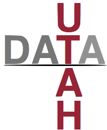

## Data Science Academic Programs at University of Utah

{: style="float:right"}

### [Computational and Data Science](http://pmst.utah.edu/computational-and-data-science-program-of-study/)

The Computational Science Track incorporates coursework from
different mathematical disciplines to reflect the breadth of
computational and data science employed to solve real-world problems.
The degree program is offered through the College of Science with
students earning the Master of Science and Technology (MST) in
Computational Science.

### [Graduate Certificate in Big Data](http://www.cs.utah.edu/bigdata)

A graduate level certicate (15 credits) for students with at least
some CS background and some analytic experience (either probability
and linear algebra or other analytica bachground, e.g., math, physics,
econ, bioinformatics). Machine Learning, Data Mining, Visualization,
Databases, Algorithms.
  
### [Data Management and Analysis Track](http://www.cs.utah.edu/docs/Graduate/handbook16-17/datamang-2016-17.pdf)

A MS and PhD program in School of Computing focusing on the data
science aspects. Most entering students have a CS degree or similar or
extensive experience as a software engineer; some students have an
analytical background (e.g., math, statisitcs) with some computer
science background. Machine Learning, Data Mining, Visualization,
Databases, Algorithms, and advanced classes in these areas.
  
### Data Science Options of [Math MStat](http://mstat.utah.edu/degree-options/mathematics.php) and [MS in Computing](http://www.cs.utah.edu/docs/Graduate/handbook16-17/datamang-2016-17.pdf)

MS degrees for students with strong analytical backgrounds and some
programming. Not as much focus on programming but more focus on
mathematical statistics as other Computing degrees. More computing
focus, and less mathematical analysis focus compared to typical Math
MStat degree.

### [Data Science for Health Student Scholars Program](https://medicine.utah.edu/dbmi/research/data-science/)

As a Student Scholar, you will spend approximately 3-10 hours per week
and receive academic credit for a journal club in the Fall (1-2 credit
hours) and a Practicum in the Spring (1-3 credit hours). You will be
an integral part of a project team led by a Data Science for Health
Faculty Scholar.

### [BioMedical Informatics](http://medicine.utah.edu/dbmi/academics-education/index.php)

PhD and MS degrees. Physicians, nurses, pharmacists, and other health
care professionals may apply for an MS or PhD degree. In addition, the
department encourages applications for degree programs from
individuals with backgrounds in computer science, engineering,
biology, biochemistry, statistics, or other relevant fields.
  

### [Master of Science in Information Systems](http://eccles.utah.edu/programs/master-of-science-in-information-systems/)

Designed to provide the advanced education necessary to manage the
technology of business, the David Eccles School of Business Master of
Science in Information Systems (MSIS) program offers business
education with a practical slant. Industry-driven coursework and
opportunities for hands-on experience prepare our graduates for
leadership positions in one of the fastest-growing job sectors in the
world. In fact, the U.S. Bureau of Labor Statistics forecasts a 15
percent growth for employment in the IS/IT industry from 2014 to 2024.

### [Graduate Certificate in Information Systems](http://eccles.utah.edu/programs/master-of-science-in-information-systems/msis/graduate-certificate/)

The Graduate Certificate in Information Systems (GCIS) allows students
to gain specialized knowledge in information systems. Obtaining a
graduate-level certificate in IS will provide a significant advantage
to those seeking to advance their careers in the field of information
systems or strengthen their technical proficiency.

This 18-credit-hour certificate program is designed for maximum
flexibility and offers students a wide choice of courses and areas of
concentration. Courses are available primarily in the evening to meet
the needs of working professionals. Program electives and faculty are
shared with the Master of Science in Information Systems (MSIS)
program and provide the same high level of instruction and
interaction.

### [Master of Science in Business Analytics](http://eccles.utah.edu/programs/master-of-science-in-business-analytics/)

Designed to provide students with the skills necessary to compete in
the rapidly growing market for analytics and data science
professionals, the David Eccles School of Business Master of Science
in Business Analytics (MSBA) program offers a unique blend of
curriculum in both the technical and managerial space.

---

*Disclaimer*: This page is under construction. If have a Utah course
or program that we have not listed here, please contact us at the
email address below and we will include it here.
